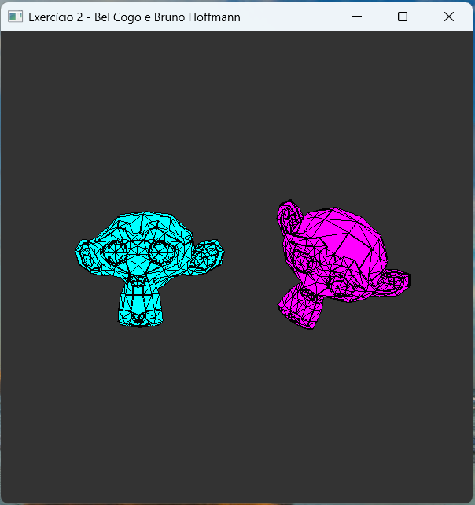
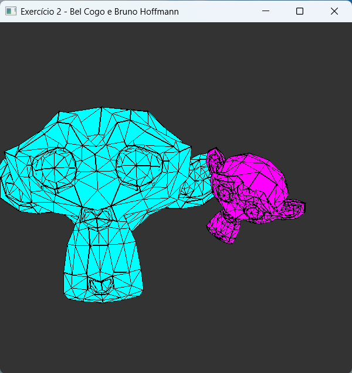
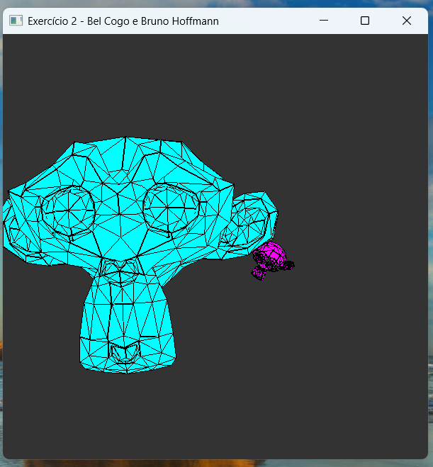

Disciplina: Processamento Gráfico: Computação Gráfica e Aplicações.

Alunos: Bel Cogo e Bruno da Siqueira Hoffmann.

# Exercício 2 - Selecionando e aplicando transformações em objetos 3D

O objetivo do exercício era fazer a leitura de um objeto utilizando um arquivo `.obj`, renderizar mais de um objeto em cena com base nas informações do arquivo, e permitir que o usuário aplicasse transformações nos objetos.

## Como Executar o Projeto

Para executar o projeto é sugerido seguir os passos descritos no tutorial presente no [link](https://github.com/fellowsheep/CG-20261/blob/main/GettingStarted.md) até o processo 4.

Após realizar o build do projeto, conforme sugerido no tutorial acima, é possível rodar o comando abaixo para executar o projeto.

```sh
cd ./build

./Exercicio2.exe
```

## Como Rodar Comandos

Com o projeto executando, é possível verificar duas Suzanes na tela. Assim, é possível fazer as seguintes interações com o programa:
- Mexer a câmera;
- Rotacionar a Suzane em diferentes eixos;
- Movimentar a Suzane em diferentes eixos;
- Modificar a escala da Suzane em diferente eixos;
- Trocar a Suzane que está aplicando as transformações.

**Movendo a Câmera:**

- Para mover a câmera você só precisa selecionar as teclas:
  - `J`: ir para esquerda;
  - `K`: ir para trás;
  - `L`: ir para direita;
  - `I`: ir para frente;

**Rotacionar a Suzane:**

- Para rotacionar a Suzane é necessário selecionar a tecla `R`, em seguida pressione a tecla referente ao eixo que deseja rotacionar a Suzane, podendo ser as teclas `X` (eixo X), `Y` (eixo Y), `Z` (eixo Z) e `C` (todos os eixos). Por fim, pressione a `seta para cima (↑)` ou `seta para baixo (↓)`;

**Movimentar a Suzane**

- Para movimentar a Suzane é necessário selecionar a tecla `T`, em seguida pressione a tecla referente ao eixo que deseja mover a Suzane, podendo ser as teclas `X` (eixo X), `Y` (eixo Y), `Z` (eixo Z) e `C` (todos os eixos). Por fim, pressione a `seta para cima (↑)` ou `seta para baixo (↓)`;

**Modificar Escala da Suzane**

- Para modificar a escala da Suzane é necessário selecionar a tecla `S`, em seguida pressione a tecla referente ao eixo que deseja modificar a escala da Suzane, podendo ser as teclas `X` (eixo X), `Y` (eixo Y), `Z` (eixo Z) e `C` (todos os eixos). Por fim, pressione a `seta para cima (↑)` ou `seta para baixo (↓)`;

**Trocando de Suzane**

- Por fim, é possível fazer transformações na outra Suzane, dessa forma, ao clicar na tecla `1` você modifica a Suzane da direita, e na tecla `2` você modifica a Suzane da esquerda;

- Outro jeito de modificar a Suzane selecionada é através da tecla `N`, o qual seleciona a próxima Suzane da fila;

## Exemplos

### Caso 1 - Rotacionar Suzane

Na figura abaixo foi feita a rotação da Suzane selecionada por padrão, utilizando a tecla `R`, a tecla `C` e a tecla `seta para cima (↑)`;



### Caso 2 - Modificar Escala da Outra Suzane

Na figura abaixo foi selecionado outra Suzane através da tecla `N`, e depois foi aumentada a escala dela através da tecla `S`, a tecla `C` e a tecla `seta para cima (↑)`;



### Caso 3 - Movimentar Suzane para Trás

Na figura abaixo foi selecionado a Suzane da direita, utilizando a tecla `1`, e depois foi movimentada ela através das teclas `T` e `seta para cima (↑)`;

